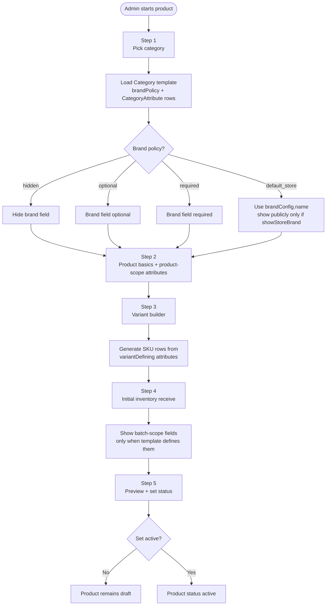
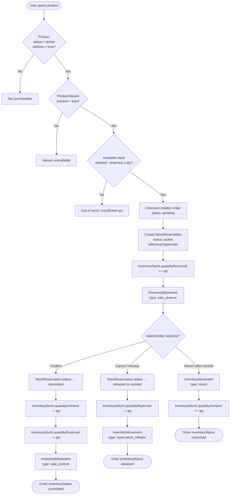
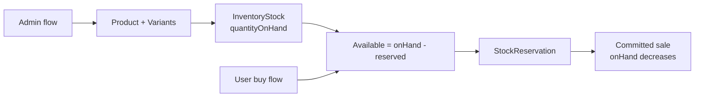

# Ecommerce schema flows

Reference diagrams for [`packages/db/prisma/schema/ecommerce.prisma`](../packages/db/prisma/schema/ecommerce.prisma).

The schema defines a **catalog + inventory + order** model. Checkout creates an `Order`, reserves stock through `StockReservation`, and admin order status changes commit, release, or restock inventory through `InventoryMovement`.

---

## Overall schema map

```mermaid
flowchart TB
  subgraph Catalog["Catalog layer"]
    CAT[Category]
    BRAND[ProductBrand]
    PROD[Product<br/>status: draft | active | archived]
    VAR[ProductVariant<br/>sku, price, currency]
    ATTR[ProductAttribute]
    ATTRVAL[ProductAttributeValue]
    CATATTR[CategoryAttribute<br/>product | variant | batch]
    PRODATTR[ProductAttributeAssignment]
    VARATTR[ProductVariantAttributeValue]

    CAT --> PROD
    CAT --> CATATTR
    BRAND -. optional .-> PROD
    PROD --> VAR
    PROD --> PRODATTR
    ATTR --> ATTRVAL
    ATTR --> CATATTR
    ATTR --> PRODATTR
    VAR --> VARATTR
    ATTRVAL --> VARATTR
    ATTRVAL -. optional .-> PRODATTR
  end

  subgraph Inventory["Inventory layer"]
    SUP[Supplier]
    LOC[InventoryLocation]
    BATCH[InventoryBatch]
    BATCHATTR[InventoryBatchAttributeAssignment]
    STOCK[InventoryStock<br/>quantityOnHand<br/>quantityReserved]
    MOVE[InventoryMovement<br/>purchase | sale_reserve | sale_commit<br/>reservation_release | return | adjustment]
    RES[StockReservation<br/>active | committed | released | expired]

    SUP -. optional .-> BATCH
    VAR --> BATCH
    BATCH --> BATCHATTR
    ATTR --> BATCHATTR
    ATTRVAL -. optional .-> BATCHATTR
    VAR --> STOCK
    VAR --> MOVE
    VAR --> RES
    LOC --> STOCK
    LOC --> MOVE
    LOC --> RES
    BATCH -. optional .-> STOCK
    BATCH -. optional .-> MOVE
    BATCH -. optional .-> RES
  end

  subgraph Orders["Order layer"]
    CART[Cart]
    CARTITEM[CartItem]
    ORDER[Order<br/>order/payment/delivery/inventory status]
    ADDR[OrderAddress<br/>shipping | billing]
    LINE[OrderLineItem<br/>snapshot]
    RATE[ShippingRate]
    EVENT[OrderStatusEvent]

    CART --> CARTITEM
    VAR --> CARTITEM
    ORDER --> ADDR
    ORDER --> LINE
    ORDER --> EVENT
    RATE -. snapshot .-> ORDER
    PROD -. snapshot .-> LINE
    VAR -. snapshot .-> LINE
  end

  USER[User] -. actorUserId .-> MOVE
  USER -. optional .-> CART
  USER -. optional .-> ORDER
```

### Model groups

| Layer | Models |
|-------|--------|
| Catalog | `Category`, `ProductBrand`, `Product`, `ProductVariant`, `ProductAttribute`, `ProductAttributeValue`, `CategoryAttribute`, `ProductAttributeAssignment`, `ProductVariantAttributeValue` |
| Inventory | `Supplier`, `InventoryLocation`, `InventoryBatch`, `InventoryBatchAttributeAssignment`, `InventoryStock`, `InventoryMovement`, `StockReservation` |
| Orders | `Cart`, `CartItem`, `Order`, `OrderAddress`, `OrderLineItem`, `OrderStatusEvent`, `ShippingRate` |

---

## Category templates drive admin forms

The admin product workflow is **category-first**. A category is not only a navigation node; it also decides brand behavior, product specs, variant options, batch fields, and public filters.



### Brand policy behavior

| Policy | Admin behavior | Public behavior |
|--------|----------------|-----------------|
| `hidden` | No brand field | No brand display |
| `optional` | Admin may pick a `ProductBrand` | Show chosen brand if present |
| `required` | Admin must pick a `ProductBrand` | Show chosen brand |
| `default_store` | No manual product brand needed | Show `brandConfig.name` only when `showStoreBrand = true` |

### Attribute scopes

| Scope | Stored in | Examples |
|-------|-----------|----------|
| `product` | `ProductAttributeAssignment` | camera, processor, origin, warranty |
| `variant` | `ProductVariantAttributeValue` + `attributesSnapshot` | color, RAM, storage, weight pack |
| `batch` | `InventoryBatchAttributeAssignment` | expiry date, harvest season, storage temperature |

### Public filters

Every category page gets common filters such as price and availability. The category template adds niche filters from `CategoryAttribute` where `filterable = true`.

Examples:

| Category | Common filters | Template filters |
|----------|----------------|------------------|
| Phones | price, availability, brand | color, RAM, storage, processor, camera |
| Mango | price, availability | origin, grade, weight pack |
| Honey | price, availability | origin, weight pack |

---

## Case 1 — User buys or tries to buy

**Available stock** = `quantityOnHand - quantityReserved` on `InventoryStock` (per variant + location + optional batch).



### Step-by-step

| Step | What happens | Tables touched |
|------|----------------|----------------|
| Browse | User sees products only if `Product.status = active` and `isActive = true` | `Product`, `Category`, `ProductBrand` |
| Pick variant | Price/SKU come from `ProductVariant`; attributes from `ProductVariantAttributeValue` | `ProductVariant`, `ProductAttributeValue` |
| Stock check | App reads `InventoryStock` for that `variantId` (+ `locationId`, optional `batchId`) | `InventoryStock` |
| Checkout | `Order`, structured addresses, line item snapshots, shipping snapshot, and active reservations are created | `Order`, `OrderAddress`, `OrderLineItem`, `StockReservation`, `InventoryMovement` (`sale_reserve`) |
| Admin confirms | Reservation → `committed`; on-hand drops, reserved drops | `StockReservation`, `InventoryStock`, `InventoryMovement` (`sale_commit`) |
| Admin cancels / reservation expires | Reservation → `released` or `expired`; reserved qty freed | `StockReservation`, `InventoryStock`, `InventoryMovement` (`reservation_release`) |
| Return | Stock goes back via `return` movement | `InventoryMovement`, `InventoryStock` |

### Inventory movement types (customer-facing)

| Type | When |
|------|------|
| `sale_reserve` | User starts checkout; stock is held |
| `sale_commit` | Payment succeeds; sale is final |
| `reservation_release` | Checkout cancelled or reservation expired |
| `return` | Customer returns item; stock restored |

---

## Case 2 — Admin adds products

New products start as **`draft`** (`ProductStatus` default). Stock is added separately through the inventory chain.

```mermaid
flowchart TD
  START([Admin adds product]) --> CAT{Category exists?}
  CAT -->|No| CREATE_CAT[Create Category<br/>name, slug, parentId optional]
  CAT -->|Yes| BRAND
  CREATE_CAT --> BRAND{Brand needed?}

  BRAND -->|Yes| CREATE_BRAND[Create ProductBrand]
  BRAND -->|No| CREATE_PROD
  CREATE_BRAND --> CREATE_PROD[Create Product<br/>status: draft<br/>categoryId required<br/>cover image, keywords, SEO fields]

  CREATE_PROD --> ATTRS{Variant attributes?<br/>size, color, etc.}
  ATTRS -->|Yes| CREATE_ATTR[Create ProductAttribute<br/>variantDefining = true]
  CREATE_ATTR --> CREATE_VAL[Create ProductAttributeValue]
  ATTRS -->|No| CREATE_VAR

  CREATE_VAL --> CREATE_VAR[Create ProductVariant(s)<br/>sku, price, currency<br/>optional image URLs<br/>attributesSnapshot JSON]

  CREATE_VAR --> LINK_ATTR[Link variant ↔ attribute values<br/>ProductVariantAttributeValue]
  LINK_ATTR --> PUBLISH{Publish product?}

  PUBLISH -->|No| DRAFT([Product stays draft — not sold yet])
  PUBLISH -->|Yes| ACTIVE[Product.status → active]

  ACTIVE --> STOCK{Add stock now?}
  STOCK -->|No| LIVE_NO_STOCK([Live but 0 stock — cannot sell])
  STOCK -->|Yes| SETUP_INV

  subgraph SETUP_INV["Receive inventory"]
    LOC[Ensure InventoryLocation exists]
    SUP[Optional: Supplier]
    BATCH[Create InventoryBatch<br/>variantId, supplierId, unitCost]
    STOCK_ROW[Create or update InventoryStock<br/>quantityOnHand += qty]
    MOVE[InventoryMovement<br/>type: purchase<br/>actorUserId = admin User]
    LOC --> BATCH --> STOCK_ROW --> MOVE
    SUP -.-> BATCH
  end

  SETUP_INV --> READY([Product sellable<br/>active variant + stock on hand])
```

### Step-by-step

| Step | What happens | Tables touched |
|------|----------------|----------------|
| Category | Required — `Product.categoryId` has `onDelete: Restrict` | `Category` |
| Brand | Optional | `ProductBrand` |
| Product | Created with `status: draft` by default | `Product` |
| Attributes | Global attribute definitions; values shared across products | `ProductAttribute`, `ProductAttributeValue` |
| Variants | One product → many SKUs/prices; default variant via `isDefault` | `ProductVariant` |
| Variant ↔ attribute link | Junction table for filterable/searchable attributes | `ProductVariantAttributeValue` |
| Publish | Set `Product.status = active` (and `isActive = true`) to allow sales | `Product` |
| Receive stock | Batch from supplier → stock row at a location | `Supplier`, `InventoryBatch`, `InventoryLocation`, `InventoryStock` |
| Audit | Every stock change should log a movement; admin linked via `actorUserId` | `InventoryMovement` (`purchase`), `User` |

### Inventory movement types (admin-facing)

| Type | When |
|------|------|
| `purchase` | New stock received from supplier |
| `adjustment` | Manual correction (count mismatch, damage) |
| `transfer_in` / `transfer_out` | Move stock between `InventoryLocation`s |

---

## How the two flows connect



---

## Orders V1 implemented behavior

- Storefront cart supports guest cookie carts and signed-in user carts.
- Checkout uses server-side variant prices and active `ShippingRate` rows.
- Orders store structured `OrderAddress` snapshots and `OrderLineItem` snapshots.
- `Order.inventoryStatus` is the guardrail for idempotent stock transitions.
- Admin confirmation commits reservations; cancellation releases them; returns/restocked committed orders add stock back once.

Expired reservations can be released through the admin cleanup endpoint. A scheduled job can call the same behavior later.

---

## Viewing the diagrams

- **GitHub / GitLab**: Mermaid blocks render automatically in markdown previews.
- **VS Code / Cursor**: Install a Mermaid preview extension, or use the built-in markdown preview if Mermaid is supported.
- **Online**: Paste a diagram block into [mermaid.live](https://mermaid.live).
